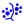

# Circuit Map

Circuit Map is a Django application which can act as a drop-in
extension for [CATMAID](https://catmaid.readthedocs.io/en/latest/extensions.html).

Circuit Map provides tooling to integrate remote skeletons derived from automated segmentations
and automatically generated synaptic link data into CATMAID circuit mapping workflows.

An example use of the tool is based on automatically generated synaptic link data by [Buhmann et al. 2019](https://www.biorxiv.org/content/10.1101/2019.12.12.874172v1) for the [FAFB dataset](http://www.temca2data.org/). Synaptic link data can be added to manually reconstructed skeletons or automatically generated skeletons derived from a [whole brain segmentation](https://fafb-ffn1.storage.googleapis.com/landing.html). Up- and downstream skeleton partners derived from this synaptic link data can be imported automatically into the current CATMAID project.

## Integration into CATMAID

1. Install the dependencies with `pip install -r requirements.txt`.

2. Install circuitmap in whichever python environment is running
   CATMAID with `pip install -e .`

3. Make sure your CATMAID instance has RabbitMQ and Celery enabled, it's needed
   to fetch synapses asynchronously. The [documentation](https://catmaid.readthedocs.io/en/stable/celery.html)
   has more information about this.

4. Create a ``settings.py`` file based on the example in the
   ``circuitmap/control/`` folder. A few additional settings have to be
   configured to interoperate with segmentation data and CATMAID import
   procedure.

5. Run `python manage.py migrate` (in the CATMAID folder) to create the circuitmap models.

6. Run `python manage.py collectstatic -l`  (in the CATMAID folder) to pick up
   circuitmap's static files.

7. The synaptic link data needs to be ingested into the generated
   Postgres table `circuitmap_synlinks` from the [SQL database dump](https://github.com/funkelab/synful_fafb).

## Usage

Once the extension is installed and integrated into CATMAID, a new API and a
new front-end widget is available in your CATMAID instance. All interaction in
the front-end happens through this widget, this is how it can be opened:

1. On the CATMAID front-page, open the image stack you want to work in
   primarily. In the example FAFB v14 project, click on the *FAFB00 V14 XY*
   link.

2. Select the tracing tool in CATMAID by clicking on the neuron like icon
   button in the top toolbar: 

3. Click the Circuit Map icon in the top toolbar ().
   Should it be hidden due to limited screen space, it is also possible to use
   the *Open Widget* dialog by using the first icon button in the top toolbar:
   , or
   alternatively <kbd>Ctrl</kbd> + <kbd>Space</kbd>, and searching for "Circuit
   Map". Enter or double-click on the result row will open a new *Circuit Map
   widget*.

Circuit Map can operate in two modes: it can fetch a) all synapses for the
currently selected skeleton and b) fetch a segmentation based skeleton for a
given location along with the synapses linked to it. For both modes, existing
synapses in the target project are used if they are available and match the
automatically generated synapse.

Additionally, both modes allow to also fetch the respective partner fragments
for each synapse that is available from the segmentation data. Both modes are
described in more detail below.

### Fetching synapses for the active skeleton.

To find all synapses for a particular skeleton/neuron, the respective skeleton
has to be selected first in CATMAID. A straight-forward way to find neurons is
by opening the *Neuron Navigator*:

1. Either click the compass icon in the toolbar or search for "Navigator" in the
   *Open Widget* dialog (see above). 
2. Double-click on "All neurons" and double-click a neuron that you want to add
   synapses too.
3. Click on <kbd>Go to nearest node</kbd> to select the skeleton.

With a skeleton selected, go back to the *Circuit Map* widget and press the
<kbd>Fetch synapses for active neuron</kbd>. This will queue an asynchronous task
on the server which will fetch all synapses for the active skeletons. Depending
on the setup of the CATMAID instance, the front-end will refresh automatically,
once the data is ready (if [WebSockets/ASGI](https://catmaid.readthedocs.io/en/stable/websockets.html)
is enabled). Alternatively the current view can be reloaded by clicking on the
*Tracing Tool* icon.

### Fetching the segmentation fragment at a location plus its synapses

If no existing neuron is already present at a location of interest, Circuit Map
can be used to fetch a segmentation based skeleton fragment along with synapses
connected to it. The widget will use the center of the field of view in the
active stack viewer as query location. This can be easier to see by enabling
reference lines that cross at the center of the view. This can be done by

1. Opening the *Settings Widget* by clicking on the Gear icon in the top toolbar (third from left).
2. Find the "Display reference lines" option in the "Stack view" section and enable.

When ready, press <kbd>Fetch autoseg skeleton and synapses at location</kbd> in
the *Circuit Map widget*. This will kick off a background task on the server
that fetches the closest segmentation fragment along with its synapses.
Typically, this process takes not longer than a few seconds. After a refresh
(either automatically if set up or manually by reloading the *Tracing Tool*,
the new skeleton should appear and can be used like any other skeleton.

### Fetching partner fragments

TBA
